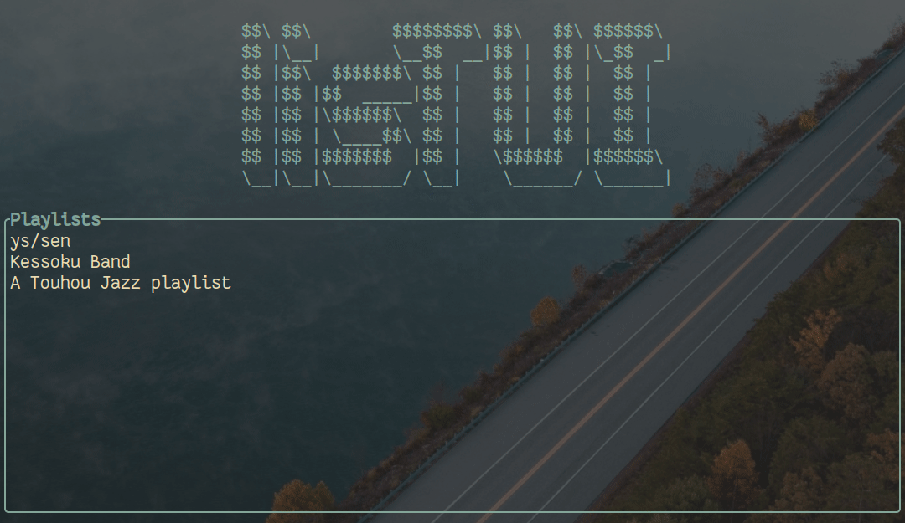

# listTUI

 A simple, easy to use music player for the terminal, written in rust. Currently it support playing local and youtube playlists.




# Installation

## Using cargo

You can compile and install lisTUI using the following command.
```
cargo install listui
```

The following dependencies are needed to compile the app:

- [Development packages for libssl](https://docs.rs/openssl/0.10.25/openssl/#automatic)
- Working git and cmake installations, and a c++ compiler.

If  you want to be able to play youtube playlists, please make sure you have [yt-dlp](https://github.com/yt-dlp/yt-dlp#installation) and [ffmpeg](https://ffmpeg.org/download.html) installed as well.

## Manual installation

WIP

# Usage

Play a playlist stored in your computer:

```
listui ~/Music/playlist1
```

Or a YouTube playlist:

```
listui "https://www.youtube.com/playlist? list=PLauaob2FukqdpQf4g4ph7kY3IHOr-BwzJ"
```

Or just launch the app and see all your saved playlists:

```
listui
```

# Configuration

Currently lisTUI only has only three configurable settings:

- **DATABASE_PATH**: the path where the sqlite database will be stored.
- **DOWNLOAD_DIR**: the directory where newly downloaded tracks will be stored.
- **YT_API_KEY**: by default, lisTUI uses the API of various [Invidious](https://github.com/iv-org/invidious) instances to fetch information about the requested playlists. If you want to use YouTube instead, you can get get you own API key and put it here.

lisTUI will look for the file ~/.config/listui.config and read the settings from there. Here's an example of listui.config file:
```
YT_API_KEY=some_key
DOWNLOAD_DIR=/home/user/Music/my_downloaded_songs
```